<div align="right">

</div>

# TDA HASH

## Repositorio de Eduardo González - 110006 - eegonzale@fi.uba.ar

- Para compilar:

```bash
make pruebas_chanutron
```

- Para ejecutar:

```bash
./pruebas_chanutron
```

- Para ejecutar con valgrind:
```bash
make valgrind_chanutron
```
---

<h1>Diccionarios</h1>

Un diccionario es una estructura de datos que organiza y almacena información en pares de elementos, generalmente llamados "claves" y "valores". Cada clave está asociada a un valor específico, de manera que puedes buscar o recuperar información usando esa clave.

Los diccionarios son útiles para buscar rápidamente información específica sin tener que recorrer todos los elementos, ya que permiten acceso directo a través de las claves. Es importante destacar que dichas claves son únicas. 

<h1>Función de Hash</h1>

Las funciones de hash son aquellas funciones que transforman claves en un número asociado. Una buena función de hash debe distribuir uniformemente las entradas a través de su espacio de salida (que podría ser un arreglo por ejemplo) para minimizar colisiones (caso en el que claves distintas dan el mismo valor de "hash").

<div align="center">
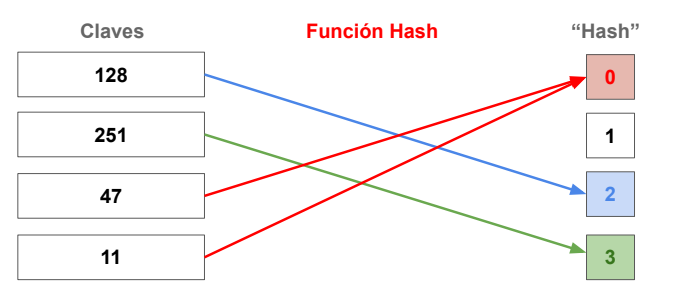
</div>

Entre sus características principales se encuentra

Unidireccionalidad (One-Way):la función de hash debe ser unidireccional, lo que significa que debe ser fácil calcular el hash a partir de la clave, pero debe ser computacionalmente difícil (idealmente imposible) recuperar la clave original a partir del hash. 

Carácter Único del Valor de Hash: cada valor de hash debe ser único para una clave dada, lo que significa que dos claves distintas no deberían generar el mismo valor de hash. Esto se conoce como la propiedad de "sin colisiones" y es fundamental para garantizar la integridad y precisión de la tabla de hash.

Sensibilidad a Cambios: pequeños cambios en la entrada deberían producir cambios significativos en el valor de hash. Esto evita situaciones en las que dos claves ligeramente diferentes generan el mismo valor de hash, lo que podría dar lugar a colisiones no deseadas.

<h1>Tabla de Hash</h1>

Una tabla de hash es una estructura de datos que implementa una colección de pares clave-valor, donde cada clave es única. Utiliza una función de hash para transformar las claves en índices de un arreglo, permitiendo un acceso rápido a los valores asociados con esas claves. Sin embargo, puede ocurrir una colisión cuando dos claves diferentes generan el mismo índice.

Métodos de Resolución de Colisiones:

Encadenamiento (Chaining): en este método, cada celda de la tabla de hash es un nodo enlazada. Cuando se produce una colisión, los elementos con claves diferentes pero que generan el mismo índice se almacenan en la misma celda, formando una cadena.

<div align="center">
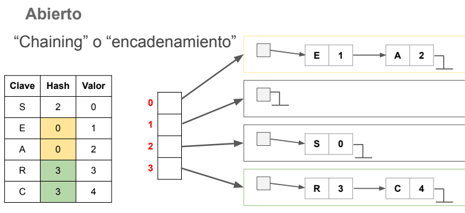
</div>

Probing: este método busca la siguiente celda o espacio disponible en la tabla de hash cuando ocurre una colisión. El criterio para buscar el siguiente espacio disponible puede ser lineal, cuadrático, etc. Dejamos las siguientes dos figuras para ver como se realiza esta operación. 

<div align="center">
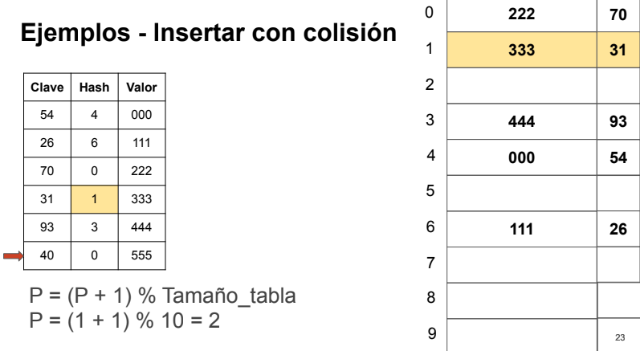
</div>

Insertamos en el siguiente espacio libre

<div align="center">
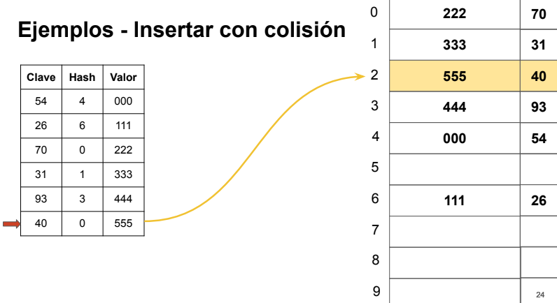
</div>

Zona de desborde: se utiliza una zona de desborde o tabla separada para almacenar elementos cuando hay colisiones. En lugar de reasignar el índice, los elementos adicionales se colocan en una ubicación de desbordamiento.

<div align="center">
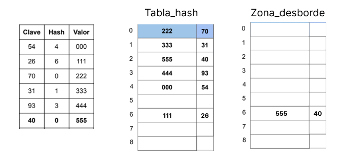
</div>

<h1>Funcionamiento</h1>

<h2>Creación del hash</h2>

Esta función crea una nueva tabla de hash. Primero, verifica que la capacidad sea 3 como mínimo y, después, reserva la memoria necesaria para la tabla y su vector interno. Si todo sale bien, se obtiene una tabla de hash lista para usar; si algo falla, devuelve NULL,

<div align="center">
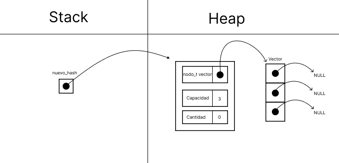
</div>

<h2>Inserción</h2>

 Primero, se verifica si la tabla y la clave son válidas. Luego, se calcula la carga actual de la tabla y, si supera un cierto umbral, se realiza una rehash (Dejamos abajo una figura de como funciona el rehash).
 
 <div align="center">
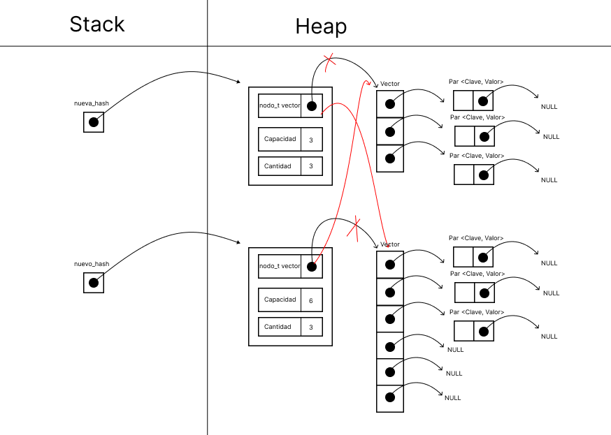
</div>
 
 Después, se determina la posición en la tabla usando una función de hash y se manejan los casos de colisión, ya sea insertando nodos enlazados o actualizándolos. Finalmente, se actualiza la cantidad de elementos y, si es necesario, se registra el valor anterior antes de devolver la tabla actualizada. Si algo sale mal en el proceso, la función devuelve NULL. 

<div align="center">
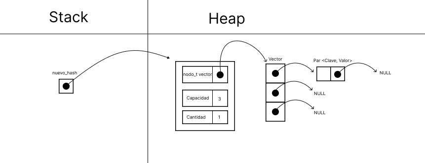
</div>

Insertamos una nueva <clave, valor> en la posicion 0.

<div align="center">
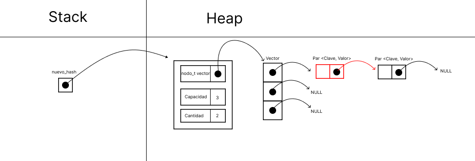
</div>

<h2>Eliminación</h2>

Se verifica si la clave está presente en la tabla utilizando la función hash_contiene. Si la clave no está presente, la función devuelve NULL. Luego, se determina la posición en la tabla usando la función de hash. Se recorren los nodos enlazados correspondientes a esa posición hasta encontrar el nodo con la clave buscada. 

<div align="center">
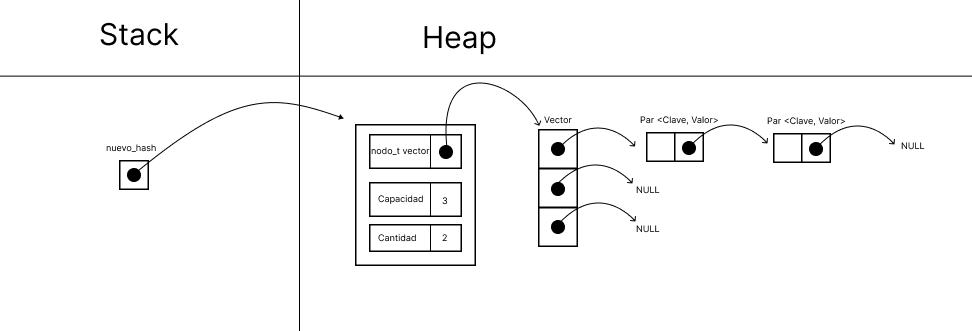
</div>

Se actualizan los punteros para eliminar el nodo encontrado, y se libera la memoria asociada al nodo. Finalmente, se decrementa la cantidad de elementos en la tabla y se devuelve el valor del elemento eliminado. Si algo sale mal en el proceso, la función también puede devolver NULL. 

<div align="center">
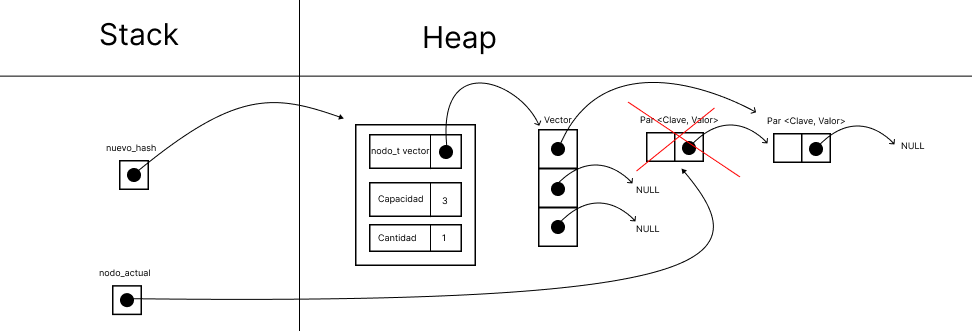
</div>

<h2>Obtención</h2>

La función determina la posición en la tabla mediante la función de hash y recorre los nodos enlazados correspondientes a esa posición. Si encuentra un nodo cuya clave coincide con la clave buscada, la función devuelve el valor asociado a esa clave. Si llega al final de la lista sin encontrar la clave, devuelve NULL. La figura de abajo muestra como se recorren los nodos paso a paso. 

<div align="center">
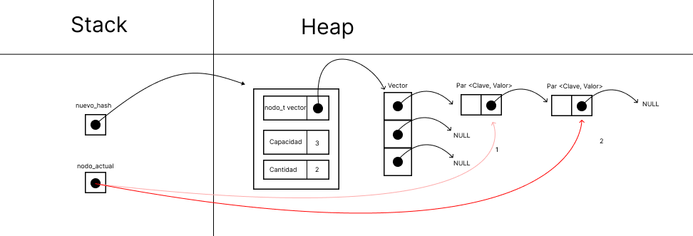
</div>

